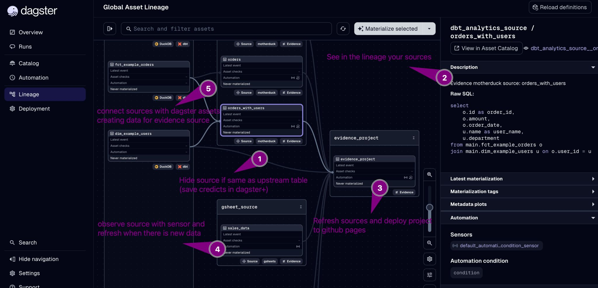

# Dagster + Evidence Integration Example

This project demonstrates the integration between [Dagster](https://dagster.io/) and [Evidence.dev](https://evidence.dev/), enabling data orchestration with automated BI dashboard deployment.



## Overview

This integration provides:

- **Auto-generated Assets**: Automatically discovers SQL sources in your Evidence project and creates corresponding Dagster assets
- **GitHub Pages Deployment**: Built-in support for deploying Evidence dashboards to GitHub Pages
- **Extendable Architecture**: Easily add new deployment targets (Netlify, Vercel, custom) or data sources

## How It Works

### Auto-Generated Assets and Sources

The integration scans your Evidence project's `sources/` folder and automatically:

1. Discovers data source connections (DuckDB, Motherduck, BigQuery, etc.)
2. Creates a Dagster asset for each SQL query file
3. Generates a main `build_and_deploy_evidence_project` asset that depends on all source assets
4. Tracks lineage and dependencies across your data pipeline

When you materialize the build asset, it:
- Installs Evidence dependencies
- Runs source queries
- Builds the static site
- Deploys to your configured target

### Github pages with local evidence project omponent example

Define your Evidence project in `defs.yaml`:

```yaml
# src/dagster_evidence_example/defs/dagster_evidence_github_pages/defs.yaml

type: dagster_evidence.EvidenceProjectComponentV2
attributes:
  evidence_project:
    project_type: local
    project_path: ../../../evidence_project
    project_deployment:
      type: github_pages
      github_repo: milicevica23/dagster-evidence-example
```


## Project Structure

```
dagster-evidence-example/
├── src/
│   ├── dagster_evidence_example/
│   │   ├── definitions.py          # Entry point with load_from_defs_folder
│   │   └── defs/
│   │       └── dagster_evidence_github_pages/
│   │           └── defs.yaml       # Component configuration
│   └── evidence_project/           # Evidence.dev BI project
│       ├── pages/                  # Dashboard pages (markdown)
│       ├── sources/                # Data sources and SQL queries
│       └── evidence.config.yaml    # Evidence configuration
├── pyproject.toml
└── README.md
```

### Deployment Targets

The architecture supports multiple deployment targets through the `BaseEvidenceProjectDeployment` class:

| Target | Status | Description |
|--------|--------|-------------|
| GitHub Pages | Implemented | Deploy to `gh-pages` branch |
| Custom Command | Implemented | Run any deployment script |
| Netlify | Planned | Deploy to Netlify |
| Evidence Studio | Future | Native Evidence Cloud integration |

To add a new deployment target, extend `BaseEvidenceProjectDeployment` and implement the `deploy_evidence_project` method.

### Data Sources

Supported source types:
- DuckDB (local files)
- Motherduck (cloud DuckDB)
- BigQuery

Sources are automatically discovered from your Evidence project's `sources/` folder.

### Installing the WIP Integration

To use the work-in-progress version of `dagster-evidence`, reference the `pyproject.toml` in this repo. With `uv`, add to your `[tool.uv.sources]`:

```toml
[tool.uv.sources]
dagster-evidence = { git = "https://github.com/milicevica23/community-integrations", branch = "feat/add-new-evidence-component-v2", subdirectory = "libraries/dagster-evidence" }
```

## TODO

- [ ] **Implement different data sources with dependencies**: Add support for multiple source types (PostgreSQL, Snowflake, BigQuery) with proper dependency tracking between sources
- [ ] **Create sensors for source observation**: Build sensors that monitor data sources for changes and automatically trigger dashboard refreshes when upstream data is updated
- [ ] **Add source freshness monitoring**: Implement freshness policies to track when sources were last updated and alert on stale data
